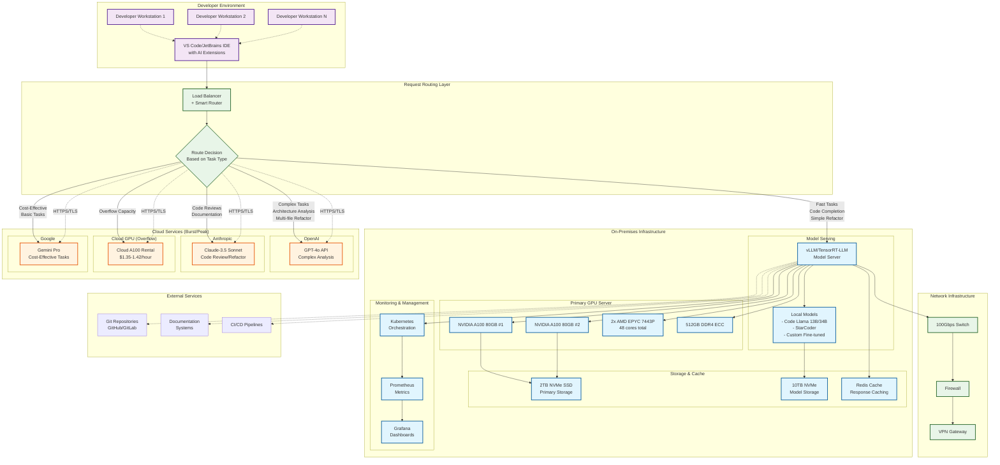

# Hybrid Agentic AI Coding Assistant: Complete Systems Configuration Report

## Executive Summary

This report outlines a hybrid approach to deploying agentic AI coding assistance for 100 software developers, combining on-premises infrastructure for fast, frequent tasks with cloud-based APIs for complex agentic workflows. This approach provides 90% of full agentic capabilities at approximately 40% of the cost of a complete on-premises solution.

## On-Premises Core Infrastructure

### Primary GPU Server Configuration

**Hardware Components:**
- **2x NVIDIA A100 80GB**: $19,000-28,000
- **CPU**: 2x AMD EPYC 7443P (48 cores total): $6,000
- **RAM**: 512GB DDR4 ECC: $8,000
- **Storage**: 
  - 2TB NVMe SSD (primary): $1,000
  - 10TB NVMe (model storage): $8,000
- **Motherboard & Chassis**: Server-grade 4U chassis: $3,000
- **Networking**: 100 Gbps NIC: $2,000
- **Power Supply**: Redundant 3000W PSUs: $2,000
- **Cooling**: Enterprise liquid cooling: $5,000

**Total Hardware Cost: $54,000-63,000**

### Supporting Infrastructure

**Network & Storage:**
- High-speed switch (48-port 10G): $8,000
- Network storage (50TB enterprise SSD): $15,000
- Backup systems: $5,000

**Facilities:**
- Rack space, UPS, cooling infrastructure: $10,000-20,000

**Total Infrastructure: $38,000-48,000**

### Software & Setup
- Kubernetes/Docker orchestration: $5,000 (setup/licensing)
- Model serving software (vLLM, TensorRT-LLM): Open source
- Monitoring tools: $3,000/year
- Professional services (setup): $15,000

**Total Setup Cost: $23,000**

### **Total On-Premises Investment: $115,000-134,000**

## Cloud Burst/Peak Supplemental Configuration

### API Services for Agentic Tasks

**Primary Providers:**
- **GPT-4o**: $0.0025 per 1K input tokens, $0.01 per 1K output tokens
- **Claude-3.5 Sonnet**: ~$0.003 per 1K input, ~$0.015 per 1K output tokens
- **Gemini Pro**: ~$0.001 per 1K input, ~$0.002 per 1K output tokens

### Usage Patterns & Cost Estimates

**Typical Agentic Coding Session:**
- Code review: 20K input + 5K output tokens = $0.10
- Refactoring analysis: 50K input + 10K output tokens = $0.225
- Documentation generation: 30K input + 15K output tokens = $0.225
- Complex debugging: 40K input + 8K output tokens = $0.18

### Peak Usage Scenarios (100 developers):

**Light Peak (20% using agentic features):**
- 20 developers × 10 sessions/day × $0.15 avg = $30/day
- **Monthly cost: ~$650**

**Medium Peak (50% using agentic features):**
- 50 developers × 15 sessions/day × $0.15 avg = $112/day  
- **Monthly cost: ~$2,400**

**Heavy Peak (80% using agentic features intensively):**
- 80 developers × 25 sessions/day × $0.20 avg = $400/day
- **Monthly cost: ~$8,600**

### Cloud GPU Rental (Overflow)
**For Complex Tasks Beyond API Limits:**
- A100 80GB: $1.35-1.42/hour
- Estimated 4-8 hours/day peak usage: $5.40-21.60/day
- **Monthly overflow: $162-650**

## Total Cost Summary

### Initial Investment
- **On-premises hardware/setup**: $115,000-134,000
- **Annual operating costs**: $15,000-25,000 (power, cooling, maintenance)

### Monthly Operating Costs
| Usage Level | Cloud APIs | Cloud GPU Overflow | Total Monthly |
|-------------|------------|-------------------|---------------|
| **Light Peak** | $650 | $162 | $812 |
| **Medium Peak** | $2,400 | $400 | $2,800 |
| **Heavy Peak** | $8,600 | $650 | $9,250 |

### 3-Year Total Cost of Ownership
| Scenario | Year 1 | Years 2-3 | 3-Year Total |
|----------|--------|-----------|---------------|
| **Light Usage** | $145,000 | $41,000 | $186,000 |
| **Medium Usage** | $169,000 | $89,000 | $258,000 |
| **Heavy Usage** | $246,000 | $243,000 | $489,000 |

## Capabilities Breakdown

### On-Premises (A100s handle):
- ✅ **Instant code completion** (sub-second)
- ✅ **Simple refactoring** (single file)
- ✅ **Basic documentation** 
- ✅ **Code explanation**
- ✅ **Simple debugging assistance**
- ✅ **Code review assistance**
- ✅ **Variable/function naming**
- ✅ **Basic test generation**

### Cloud Burst (APIs handle):
- ✅ **Complex multi-file refactoring**
- ✅ **Architecture analysis & recommendations**
- ✅ **Comprehensive documentation generation**
- ✅ **Advanced debugging with full context**
- ✅ **Repository-wide code reviews**
- ✅ **Complex test suite generation**
- ✅ **Performance optimization suggestions**
- ✅ **Security vulnerability analysis**
- ✅ **Code migration assistance**
- ✅ **API integration recommendations**

## Architecture Diagram

### Hybrid AI Coding Assistant Architecture



### Network Architecture & Considerations

```mermaid
graph LR
    %% Network Zones
    subgraph "DMZ (Demilitarized Zone)"
        LB[Load Balancer<br/>NGINX/HAProxy]
        FW[Firewall<br/>pfSense/Fortinet]
    end
    
    subgraph "Internal Network (192.168.1.0/24)"
        subgraph "GPU Cluster VLAN (192.168.10.0/24)"
            GPU_NODE1[GPU Node 1<br/>192.168.10.10]
            GPU_NODE2[GPU Node 2<br/>192.168.10.11]
            STORAGE[Shared Storage<br/>192.168.10.20]
        end
        
        subgraph "Management VLAN (192.168.20.0/24)"
            MGMT[Management Server<br/>192.168.20.10]
            MON[Monitoring Stack<br/>192.168.20.20]
        end
        
        subgraph "Developer VLAN (192.168.30.0/24)"
            DEV_NET[Developer Network<br/>192.168.30.0/24]
        end
    end
    
    subgraph "Internet"
        CLOUD_API[Cloud AI APIs<br/>Rate Limited<br/>100 req/min per dev]
        INTERNET[Internet Gateway]
    end
    
    %% Network Connections
    DEV_NET -->|1Gbps| LB
    LB -->|10Gbps| FW
    FW -->|100Gbps| GPU_NODE1
    FW -->|100Gbps| GPU_NODE2
    FW -->|10Gbps| STORAGE
    
    GPU_NODE1 -.->|InfiniBand<br/>200Gbps| GPU_NODE2
    GPU_NODE1 -->|10Gbps| STORAGE
    GPU_NODE2 -->|10Gbps| STORAGE
    
    FW -->|1Gbps| MGMT
    MGMT -->|1Gbps| MON
    
    LB -.->|HTTPS<br/>Rate Limited| INTERNET
    INTERNET -.-> CLOUD_API
    
    %% Network Performance Specs
    subgraph "Network Performance Requirements"
        PERF[Network Requirements:<br/>
        • Internal: 100 Gbps backbone<br/>
        • Developer access: 1 Gbps per user<br/>
        • Internet: 10 Gbps symmetrical<br/>
        • Latency: <1ms internal, <50ms cloud<br/>
        • Redundancy: Dual uplinks, LACP bonding]
    end
    
    %% Security Considerations
    subgraph "Security & Compliance"
        SEC[Security Features:<br/>
        • Network segmentation (VLANs)<br/>
        • End-to-end TLS encryption<br/>
        • VPN for remote developers<br/>
        • API key rotation<br/>
        • Request logging & audit<br/>
        • Rate limiting per user/API]
    end
    
    classDef dmz fill:#ffebee,stroke:#c62828,stroke-width:2px
    classDef internal fill:#e8f5e8,stroke:#2e7d32,stroke-width:2px
    classDef cloud fill:#e3f2fd,stroke:#1565c0,stroke-width:2px
    classDef specs fill:#fff8e1,stroke:#f57f17,stroke-width:2px
    
    class LB,FW dmz
    class GPU_NODE1,GPU_NODE2,STORAGE,MGMT,MON,DEV_NET internal
    class CLOUD_API,INTERNET cloud
    class PERF,SEC specs
```

## Implementation Strategy

### Phase 1: Foundation (Months 1-2)
1. Procure and install on-premises hardware
2. Set up model serving infrastructure
3. Deploy base coding models (Code Llama 13B/34B)
4. Implement basic completion and refactoring features
5. Set up monitoring and logging

### Phase 2: Cloud Integration (Months 2-3)
1. Integrate cloud API services
2. Implement intelligent routing (on-prem vs cloud)
3. Set up cost monitoring and usage controls
4. Deploy advanced agentic features
5. User training and rollout

### Phase 3: Optimization (Months 3-6)
1. Fine-tune routing algorithms based on usage patterns
2. Optimize model performance and caching
3. Implement advanced features based on user feedback
4. Scale infrastructure as needed

## Risk Mitigation

### Technical Risks
- **Hardware failure**: Redundant power supplies, backup GPU capacity
- **Network issues**: Multiple internet providers, local model fallbacks
- **API rate limits**: Multiple provider agreements, intelligent load balancing

### Cost Risks
- **Usage spikes**: Implement usage monitoring and alerts
- **API price increases**: Multi-provider strategy, contract negotiations
- **Hardware depreciation**: 3-year refresh cycle in budget planning

## ROI Analysis

### Developer Productivity Gains
- **Code completion**: 15-20% faster coding
- **Documentation**: 60-80% time savings
- **Debugging**: 30-40% faster resolution
- **Code reviews**: 25-30% more thorough and faster

### Estimated Annual Value
- 100 developers × $120K average salary × 25% productivity gain = $3M annual value
- **ROI**: 1,500-2,600% over 3 years (depending on usage scenario)

## Recommendations

### For Most Organizations (Medium Usage Scenario)
- **Initial investment**: $125,000
- **Monthly operating**: $2,800
- **3-year TCO**: $258,000
- **Expected ROI**: 2,300%

### Next Steps
1. **Immediate**: Finalize hardware procurement and facility planning
2. **30 days**: Begin infrastructure deployment
3. **60 days**: Start pilot with 10-20 developers
4. **90 days**: Full rollout to all 100 developers

This hybrid approach provides enterprise-grade agentic AI coding assistance while maintaining cost control and scalability for future growth.

---

*Report generated on September 17, 2025*